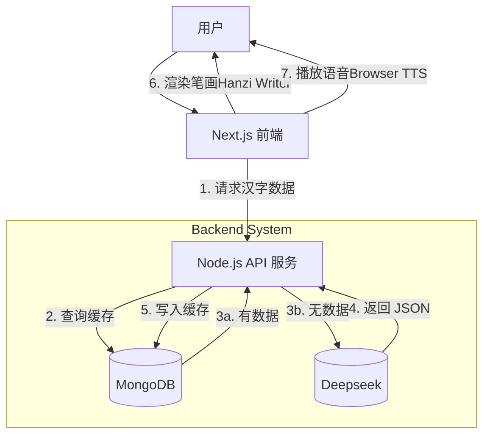

# 字趣 AI (FunHanzi AI)

# 第一部分：产品需求文档 (PRD)

**文档版本**：V1.0
**项目名称**：字趣 AI (FunHanzi AI)
**状态**：草稿

## 1. 项目背景与目标

### 1.1 背景

当前在线查字典工具大多只有静态图片和生硬的释义，缺乏互动性和趣味性。学习者（尤其是儿童和外国人）难以掌握正确的笔顺，且难以理解汉字背后的逻辑。

### 1.2 目标

构建一个**智能化、可视化**的汉字学习 Web 应用。

- **核心指标**：用户输入汉字后，3秒内展示笔顺动画 + AI 生成的趣味解析。
- **MVP 范围**：支持常用 3500 字的查询、动画演示、拼音朗读、AI 趣味讲解、基础描红练习。

## 2. 用户画像

1. **小学生家长**：需要辅导孩子写作业，纠正笔顺倒插笔。
2. **海外华裔儿童 (ABC)**：需要有趣的互动来维持学中文的动力。
3. **汉语初学者 (HSK考生)**：需要了解字形结构和场景化造句。

## 3. 功能需求 (Functional Requirements)

### 3.1 核心功能模块 (P0 - 高优先级)

| 模块            | 功能点     | 详细描述                                                     |
| --------------- | ---------- | ------------------------------------------------------------ |
| **输入与搜索**  | 汉字搜索   | 支持输入单个汉字。如果输入词组，默认解析第一个字或提示拆分。 |
| **笔画演示**    | 田字格动画 | 必须使用田字格背景；显示笔顺动画；支持重播、暂停、调整速度。 |
|                 | 笔画拆解   | 界面需显示部首、总笔画数；支持高亮当前正在写的笔画。         |
| **语音教学**    | 拼音显示   | 显示标准拼音（含声调）。                                     |
|                 | 语音朗读   | 点击喇叭图标，播放该汉字的标准发音（TTS）。                  |
| **AI 趣味课堂** | 趣味记忆   | 显示 AI 生成的“字源故事”或“巧记口诀”（例如：“休”=人靠在木头上）。 |
|                 | 组词造句   | 显示 2-3 个常用词汇 + 1 个包含拼音的生活化例句。             |
| **手写练习**    | 描红模式   | 用户可用鼠标/手指在田字格上跟随引导线写字，系统判定是否写对。 |

### 3.2 扩展功能模块 (P1 - 中优先级)

| 模块         | 功能点   | 详细描述                                                     |
| ------------ | -------- | ------------------------------------------------------------ |
| **AI 绘图**  | 意境插画 | 根据汉字含义，AI 自动生成一张卡通风格插图（如“火”字生成火焰图）。 |
| **多字模式** | 词语连播 | 输入“你好”，依次播放“你”和“好”的笔顺。                       |
| **历史记录** | 生词本   | 记录用户查询过的字，方便回顾。                               |

## 4. 非功能需求 (NFR)

- **响应速度**：笔顺动画需在 1秒内 加载；AI 文字内容需在 3秒内 流式输出。
- **兼容性**：必须适配移动端（手机/iPad竖屏）和 PC 端浏览器。
- **成本控制**：建立缓存机制，同一个字被查询第二次时，直接读取数据库，不调用 AI API。


# 第二部分：技术方案文档 (TDD)

## 1. 系统架构设计

采用 **B/S 架构**，前后端分离。

- **前端 (Client)**: 负责界面交互、笔画渲染、TTS 调用。
- **后端 (Server)**: 负责业务逻辑、API 转发、Prompt 工程、数据缓存。
- **AI 服务层**: 外部大模型接口 (LLM)。

### 架构图示



## 2. 技术栈选型

| 领域          | 技术选型                              | 理由                                                         |
| ------------- | ------------------------------------- | ------------------------------------------------------------ |
| **前端框架**  | **Next.js (React)**                   | 利于 SEO（教育类网站流量入口），开发体验好，Vercel 部署方便。 |
| **UI 组件库** | **Tailwind CSS** + **shadcn/ui**      | 快速构建现代、简洁的界面，适配移动端极其方便。               |
| **笔画引擎**  | **Hanzi Writer** (必选)               | 开源、轻量、支持笔顺数据、SVG 渲染、田字格背景。             |
| **拼音库**    | **pinyin-pro**                        | 前端直接处理拼音转换，无需查库，速度快。                     |
| **后端框架**  | **Next.js API Routes** (或 NestJS)    | 直接用 Next.js 的 Serverless Function 即可，轻量级。         |
| **数据库**    | **MongoDB**                           | 存储 AI 生成的非结构化 JSON 数据（讲解、造句）最方便。       |
| **AI 模型**   | **OpenAI GPT-4o-mini** / **DeepSeek** | 智商足够处理汉字讲解，且 API 价格极其低廉。                  |

## 3. 核心模块实现细节

### 3.1 数据库设计 (Schema)

我们需要一个 Characters 集合来缓存 AI 的结果。

```json
// MongoDB Collection: characters
{
  "_id": "ObjectId",
  "char": "猫", // 索引字段
  "pinyin": "māo",
  "radicals": "犭",
  "stroke_count": 11,
  "ai_content": {
    "story": "左边是‘犭’代表动物，右边是‘苗’，因为猫叫声像‘苗’。",
    "mnemonic": "反犬旁，苗字边，捉老鼠，它是仙。",
    "words": ["小猫", "熊猫", "花猫"],
    "sentence": "我家的小猫喜欢在窗台上晒太阳。",
    "sentence_pinyin": "wǒ jiā de xiǎo māo xǐ huan zài chuāng tái shàng shài tài yáng."
  },
  "created_at": "2023-10-27T10:00:00Z",
  "visit_count": 105 // 热度统计
}
```

### 3.2 AI Prompt 设计 (Prompt Engineering)

这是后端调用 LLM 时的核心提示词。

> **Role**: 你是一位专业的汉字教育专家，擅长用生动、童趣的语言给小学生讲解汉字。
> **Task**: 请分析汉字：“{char}”。
> **Output Format**: 严格的 JSON 格式。
> **Requirements**:
>
> 1. story: 50字以内，结合字形结构或象形来源的趣味讲解。
> 2. mnemonic: 一句顺口溜（10-15字）。
> 3. words: 2个常用组词（数组）。
> 4. sentence: 1个简单造句，适合7岁儿童理解。
> 5. sentence_pinyin: 造句对应的拼音。

### 3.3 前端笔画组件封装 (React)

文件: components/HanziWriter.js

```javascript
import React, { useEffect, useRef } from 'react';
import HanziWriter from 'hanzi-writer';

const HanziCharacter = ({ char, size = 200 }) => {
  const writerRef = useRef(null);
  const instanceRef = useRef(null); // 保存 writer 实例

  useEffect(() => {
    if (writerRef.current) {
      // 初始化 HanziWriter
      instanceRef.current = HanziWriter.create(writerRef.current, char, {
        width: size,
        height: size,
        padding: 5,
        showOutline: true,
        strokeAnimationSpeed: 1,
        delayBetweenStrokes: 200,
        radicalColor: '#e74c3c', // 部首红色
        outlineColor: '#ddd',
        strokeColor: '#333',
      });
      
      // 自动播放动画
      instanceRef.current.loopCharacterAnimation();
    }
    
    // 清理函数
    return () => {
      if (instanceRef.current) {
        // HanziWriter 没有明显的 destroy 方法，通常清空 div 内容
        if(writerRef.current) writerRef.current.innerHTML = '';
      }
    };
  }, [char, size]);

  const animate = () => instanceRef.current?.animateCharacter();
  const quiz = () => instanceRef.current?.quiz(); // 开启测验模式

  return (
    <div className="flex flex-col items-center">
      {/* 田字格背景 CSS 需单独写 */}
      <div ref={writerRef} className="tian-zi-ge bg-grid-pattern border-2 border-red-400" />
      
      <div className="mt-4 space-x-2">
        <button onClick={animate} className="btn-primary">重播</button>
        <button onClick={quiz} className="btn-secondary">写写看</button>
      </div>
    </div>
  );
};

export default HanziCharacter;
```

## 4. API 接口设计

### GET /api/character

- **参数**: ?char=猫
- **逻辑**:
  1. 检查 MongoDB 是否有“猫”的数据。
  2. **Hit (命中)**: 直接返回 DB 数据。
  3. **Miss (未命中)**:
     - 调用 OpenAI API 生成 JSON。
     - 调用 pinyin-pro 获取基础拼音信息。
     - 合并数据存入 MongoDB。
     - 返回数据给前端。

## 5. 开发阶段规划 (Roadmap)

### 第一周：原型开发 (MVP)

- **Day 1**: 初始化 Next.js 项目，配置 Tailwind CSS，完成 HanziWriter 组件封装。
- **Day 2**: 实现前端输入框 + 拼音显示 (pinyin-pro)。
- **Day 3**: 后端接入 OpenAI API，调试 Prompt，确保输出稳定的 JSON。
- **Day 4**: 连接 MongoDB，实现“查询-缓存-返回”的闭环逻辑。

### 第二周：UI 完善与交互

- **Day 5**: 设计“田字格”CSS 样式（米字格线），优化移动端布局。
- **Day 6**: 增加 TTS 语音播放功能（使用 window.speechSynthesis）。
- **Day 7**: 增加“描红测验”模式的反馈 UI（写对了放烟花动画，写错了震动提示）。

## 6. 部署方案

- **代码托管**: GitHub
- **前端/API**: Vercel (自动 CI/CD，个人项目免费)
- **数据库**: MongoDB Atlas (提供 512MB 免费沙盒集群)
- **环境变量**: 在 Vercel 后台配置 OPENAI_API_KEY 和 MONGODB_URI。

------


### 💡 给开发者的特别提示 (Tips)

1. **Hanzi Writer 数据源**: 默认情况下 Hanzi Writer 会从 CDN 加载笔画数据（SVG）。如果是国内用户，可能会慢。建议下载 hanzi-writer-data 包部署在自己的 public 文件夹中或使用国内 CDN。
2. **防抖 (Debounce)**: 在搜索框输入时，不要每输入一个字母就请求，最好在用户停止输入 500ms 后再触发 API。
3. **多音字处理**: pinyin-pro 库支持多音字识别，但在 UI 上最好列出所有读音供用户选择（例如“长”有 zhǎng 和 cháng），用户点击不同读音，AI 解释的内容也应该不同（这属于进阶需求）。


## MONGO 数据库配置

版本：mongodb 7.0.21
IP:172.30.151.83
端口：27017
用户名：hanzi
密码：hanzi6789
数据库：hanzi


## Redis配置

版本：Redis 8.0.3
IP:172.30.151.83
端口：6379
密码：redis_YT4h4n

